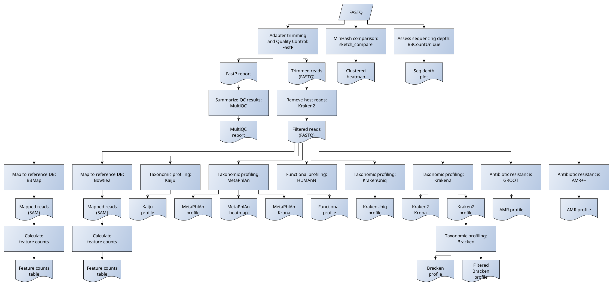

Overview of |full_name|
========================

|full_name| aims to be a universal starting point for analysis of shotgun
metagenomics data. It started out as a small workflow intended to easily
evaluate and compare the results from several different taxonomic profiling
tools to each other, but has since grown in scope to become a workflow that
runs several basic analyses on shotgun metagenomics data that can be used to
produce a set of primary analysis results that are useful to have before
starting further downstream analyses.

The following image shows a simplified graph of the workflow of |full_name|:

Note that several parts of the workflow are not yet implemented, most notably
the structure of the sections performing metagenomic assembly are not yet
finalized.
